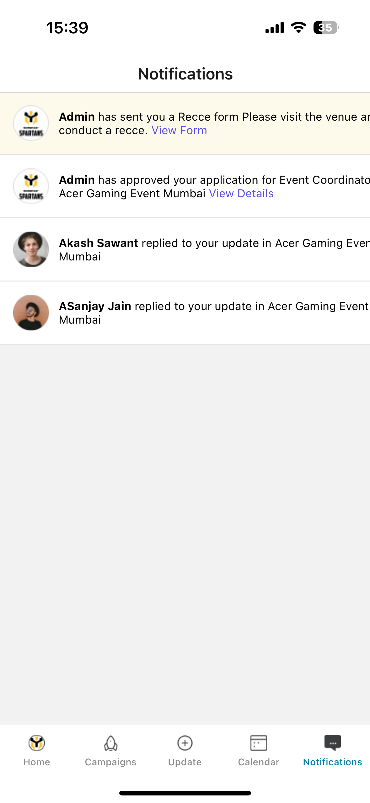
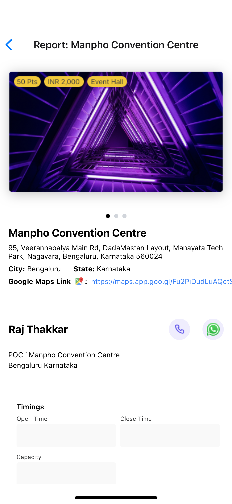
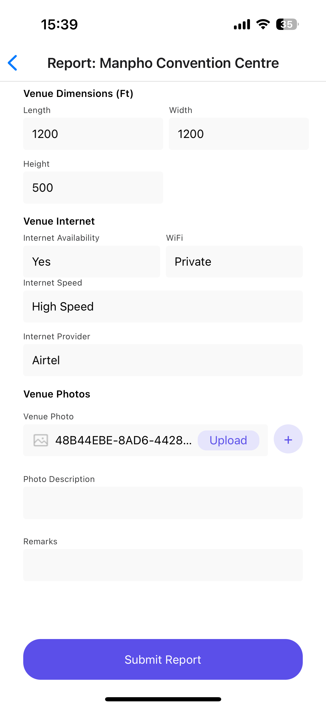
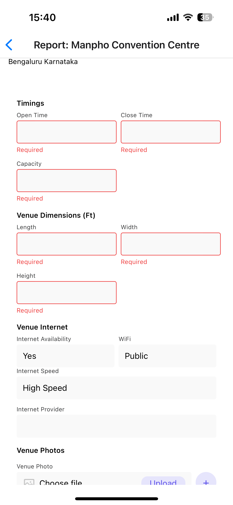
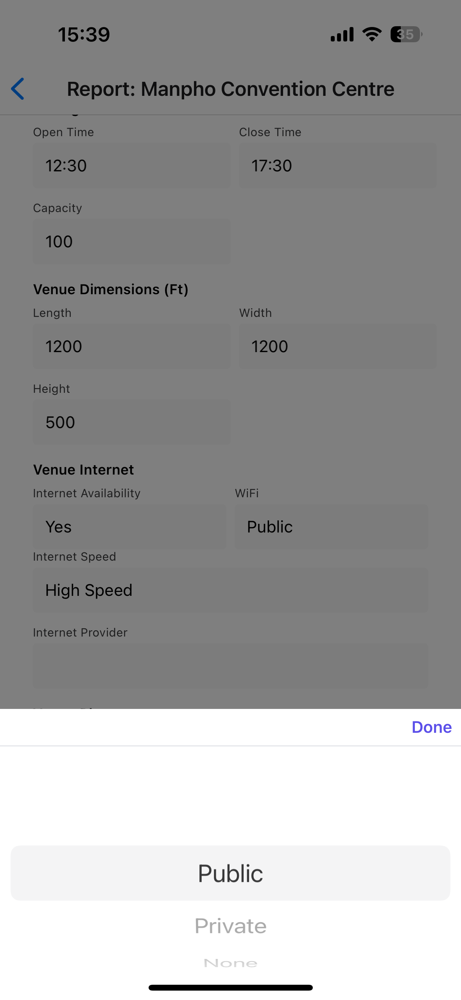
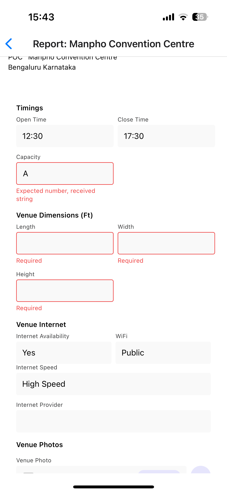
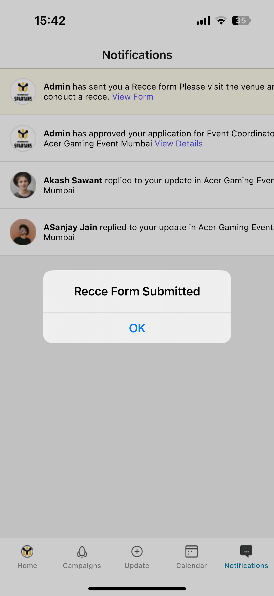

# Recce-Report-App

## Setup instructions

1. Clone the repository

   ```bash
   git clone https://github.com/MohammedAbidNafi/recce-report.git
   ```

1. Install dependencies

   ```bash
   npm install
   ```

   or

   ```bash
   bun install
   ```

1. Start the app

   ```bash
    bun start
   ```

In the output, you'll find options to open the app in a

- [development build](https://docs.expo.dev/develop/development-builds/introduction/)
- [Android emulator](https://docs.expo.dev/workflow/android-studio-emulator/)
- [iOS simulator](https://docs.expo.dev/workflow/ios-simulator/)
- [Expo Go](https://expo.dev/go), a limited sandbox for trying out app development with Expo

Scan the QR code with Expo Go (Android) or Camera app (iOS)

## Libraries used

### @react-native-picker/picker

A platform-native picker component for React Native. Used in our app for:

- Selecting internet availability options
- Choosing WiFi types
- Setting internet speed levels
- Native feel dropdown selections
- Better user experience than standard dropdowns

### expo-image-picker

Provides access to the system's UI for selecting images and videos from the phone's library or taking a photo with the camera. In our app, it's used for:

- Uploading venue photos
- Handling image selection from gallery
- Managing image permissions
- Optimizing image quality
- Supporting multiple image formats

### expo-asset

Handles asset management in Expo apps. We use it for:

- Loading local images efficiently
- Managing static assets
- Caching assets for better performance
- Handling asset loading states
- Supporting different image formats

## Challenges

### 1. Dynamic Image Loading Limitations

One of the significant challenges faced was the inability to load images dynamically in React Native. The require() function only accepts static string literals, not variables. So had to use this:

```typescript
const imageMapping = {
  profile1: require("../../assets/images/Profile/profile1.png"),
  profile2: require("../../assets/images/Profile/profile2.png"),
  admin: require("../../assets/images/Profile/profile3.png"),
};
```

Instead of loading the path from Local Storage directly

### 2. Cross-Platform UI Inconsistencies

The app faced rendering differences between iOS and web platforms. A notable example was text overflow handling - in iOS, notification text content would overflow its container and extend beyond screen boundaries, while the same content displayed properly on web.

### 3. NativeWind Version Compatibility Issues

The integration of NativeWind for styling presented version compatibility challenges. Initially installing via documentation pulled in Tailwind CSS v4, which wasn't compatible. This required:

- Manually downgrading to Tailwind CSS v3
- Downgrading NativeWind to match Tailwind v3
- Resolving dependency conflicts
- Updating configuration files

Final working versions:

```json
{
  "nativewind": "^4.0.36",
  "tailwindcss": "^3.3.2"
}
```

## App Screenshots

### Notifications Center



Real-time updates and notification management\_

### Report Details



Comprehensive view of venue details with contact information\_

### Form Submission



Interactive form for submitting venue details and specifications\_

### Form Validations


Real-time form validation and error messages_

### Picker UI


Interactive Native picker UI for selecting options

### Type Validation


Real-time type validation and error messages_

### Feedback


Feedback to show form has been submitted
